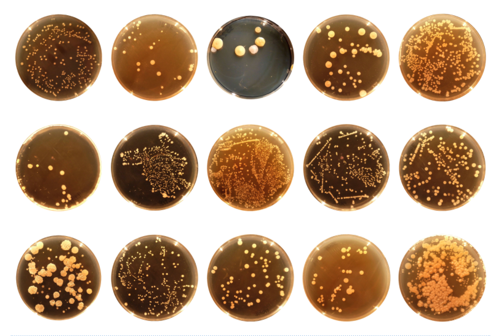
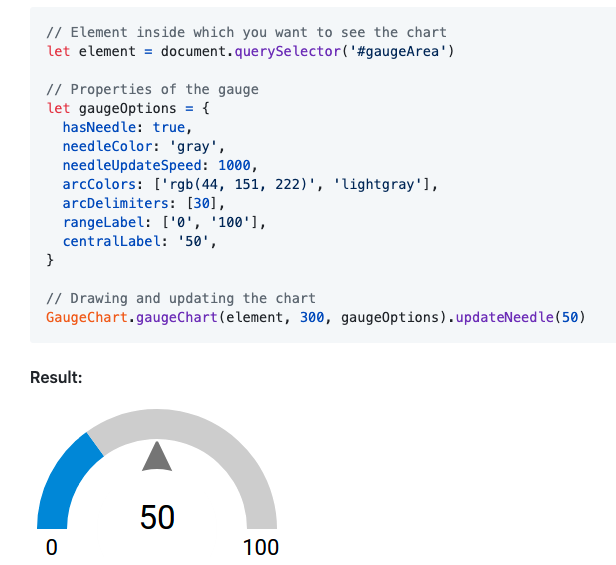
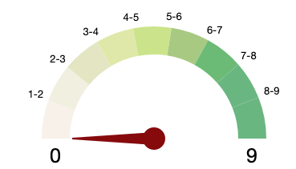

# Plot.ly Homework - Belly Button Biodiversity

This project builds an interactive dashboard to explore the [Belly Button Biodiversity dataset](http://robdunnlab.com/projects/belly-button-biodiversity/), which catalogs the microbes that colonize human navels.

The dashboard plots the data using plotly, d3 and javascript.

The dataset reveals that a small handful of microbial species (also called operational taxonomic units, or OTUs, in the study) were present in more than 70% of people, while the rest were relatively rare.

## Step 1: Plotly

1. D3 library is used to read in `samples.json`.

2. A horizontal bar chart with a dropdown menu is used to display the top 10 OTUs found in that individual.

* Use `sample_values` as the values for the bar chart.

* Use `otu_ids` as the labels for the bar chart.

* Use `otu_labels` as the hovertext for the chart.

  

3. A bubble chart is created that displays each sample.

* Use `otu_ids` for the x values.

* Use `sample_values` for the y values.

* Use `sample_values` for the marker size.

* Use `otu_ids` for the marker colors.

* Use `otu_labels` for the text values.

4. The sample metadata, i.e., an individual's demographic information is also displayed.

5. Each key-value pair from the metadata JSON object is displayed.

6. Plots update to reflect changes any time that a new sample is selected.

Additionally, you are welcome to create any layout that you would like for your dashboard. An example dashboard is shown below:

## Advanced Challenge Assignment (Optional)

The following task is advanced and therefore optional.

* The advanced challenge to adapt the Gauge Chart from <https://plot.ly/javascript/gauge-charts/> to plot the weekly washing frequency of the individual proved somewhat cumbersome. I decided to use a free library <https://github.com/recogizer/gauge-chart/> after trying to do it using javascript, and even exploring using pure css.  The free library proved to be the cleanest solution. 

* To use this library `` is added to the index.html file.  An example gauge was provided as shown below. 

* The example above was  modified to account for values ranging from 0 through 9, add arcs and correctly place the guage needle. 

* The chart is updated whenever a new sample is selected.

## Deployment

The app was deployed to a free static page hosting service - GitHub Pages. [http://annmcnamara.github.io/dashboard/Code/index.html](http://annmcnamara.github.io/dashboard/Code/index.html).

## Analysis.
Examining all the factors including age, sex, ethnicity, innie vs outie, and frequency of washing – there appear to be no differences in the number and kinds of bacteria  found in a particular person.

This is an area of ongoing research...

### Data Source

The data used in this project can be found here: 

Hulcr, J. et al.(2012) _A Jungle in There: Bacteria in Belly Buttons are Highly Diverse, but Predictable_. Retrieved from: [http://robdunnlab.com/projects/belly-button-biodiversity/results-and-data/](http://robdunnlab.com/projects/belly-button-biodiversity/results-and-data/)

- - -

© 2020 Ann McNamara
